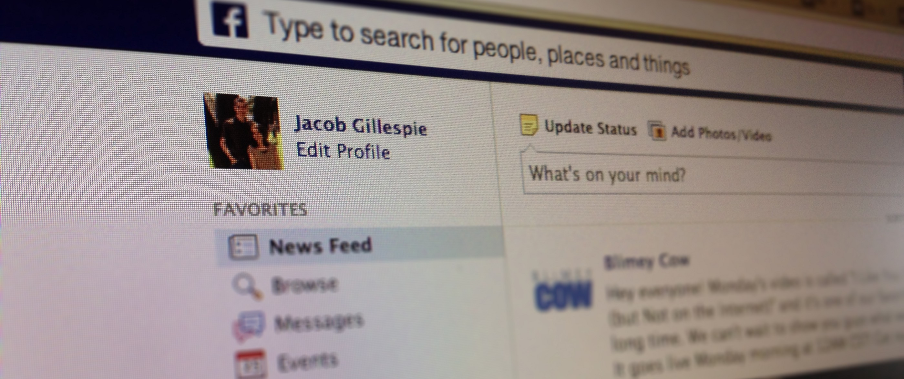

**Update August 2018:** It's been over five years. I was young and naive. This article attempts to say Facebook is not to blame for any problems because it's only a tool, and people can use it for good or bad. This is overly simplistic. Tools like Facebook are designed to encourage a particular behavior pattern, and they do this intentionally and unintentionally. Over the last few years, we've seen many ways in which Facebook has negatively impacted our society.

I've since deleted my Facebook account, for no reason other than it no longer served any positive purpose in my life. No one I cared about posted regularly, the majority of the content I saw was ads and ads disguised as viral marketing. Not taking any high road or anything, I just didn't need the account anymore.

Also, this post implies that I'm in support of the "guns don't kill people, people do" argument against increased gun control. That is a dumb argument and I am in strong favor of increased gun control. Five years ago I was still in the process of undoing a lot of childhood brainwashing, but that's a topic for another day.

tl;dr  -  Facebook has been a problem in our society, I disagree with my former self's arguments below.

---

[Bashing Facebook](https://news.ycombinator.com/item?id=5764254) seems to be a favorite pastime for many these days. From those bemoaning the visual refreshes or the privacy concerns or the supposed destruction that Facebook is wreaking on our relationships, Facebook negativity is in large supply.

The thing is, Facebook is not the problem. Facebook is a tool, and a wonderful tool at that - having such a communication platform available to everyone is a major feat.

Problems come directly from _people_.

"Pencils do not misspell words" is a common argument often given against gun control laws, and regardless of your individual stance on gun control, the premise of the statement rings true here as well. The tool is just that - a tool. An amoral tool, able to be used by those who wield it as they please, for good or bad, to build relationships or tear them down, to communicate or to kill time.

I make extensive use of Facebook's built-in friend lists (close friends, friends, and acquaintances) as well as the newsfeed settings (showing likes, photos, game activity, etc.) to carefully craft my individual experience on Facebook. I read my newsfeed sorted by most recent and have many of my friends on the "Close Friends" list so as to see most everything that is happening on Facebook in an efficient manner. I do not friend anyone I do not know and want to be connected with. And all this is done so that the people and updates that I truly care about rise to the top.

But see, the important part is the people. If Facebook disappeared tonight, never to be heard from again, I would sorely miss it. But I would be missing the ease at which I am able to communicate with those I care about, not the entity Facebook itself. Perhaps if such a scenario actually occurred, my circle of friends and loved ones would migrate to another network or another tool. But for now, Facebook makes our interaction almost painless.

Facebook is then, for me, a tool that strengthens and deepens my preexisting relationships in a way simply not possible without the internet. And that is pretty amazing.

Is Facebook perfect? No, not by any means. I really dislike the fact that most everything is geared towards Facebook monetary profit (collecting information about me, ads, pushing games and gifts, reordering my feed to keep me "engaged," etc.), and that drive for profit and the way in which I would like to use the tool sometimes collide. I do, though, fully understand that Facebook must make a profit to continue its existence (I would love a system where Facebook access cost \$10 / year or some similarly low fee), so I accept the slight inconveniences as necessary evils.

And is there room for improvement or another tool to superceed Facebook? I think so, though again, it is a very difficult proposition given how pervasive Facebook has become in today's society. Difficult yes, impossible no.

---

I really dislike the many who assume either that Facebook is the problem with society and relationships or that online interaction is not "real" and is thus not worth keeping. Online communication is a tool, and it is an unbiased tool, able to be used as the wielder chooses. It is _you_ that is choosing who you friend, it is _you_ who is sharing what you post, it is _you_ choosing how you treat others online.

Use the tool wisely.
