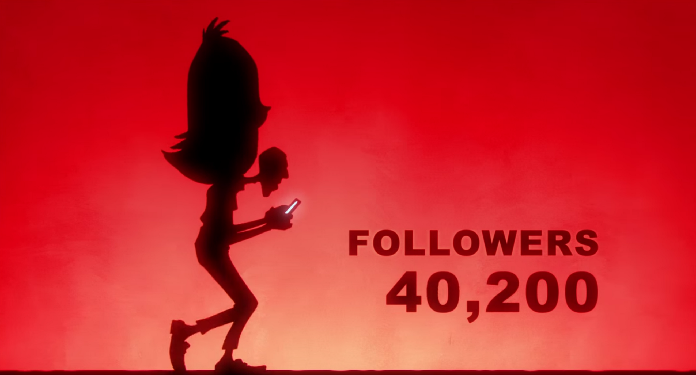

Social media is transformative, and its impact on our society is vast. This video by the French artist Strome explores some of the darker aspects of living life tethered to the internet, the burden of a public life, and the innocent trappings of this voluntary enslavement.

`youtube:https://www.youtube.com/watch?v=UKftOH54iNU`
