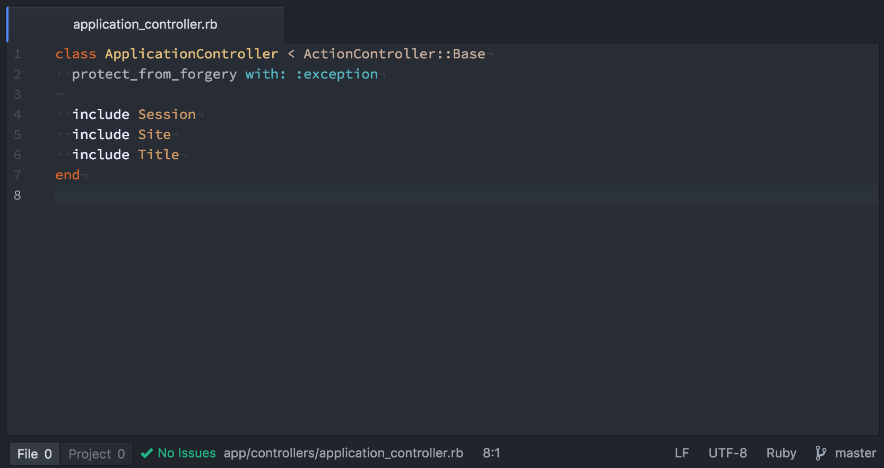

**tl;dr** - I replaced a ReactJS application with Rails + UJS. You will most likely identify this as a case where React was overkill, and I would agree. This article is an exploration of the decisions and events that lead to that realization, in the hopes that it might benefit others.

Additionally, React is awesome and has transformed what is possible in frontend web development. There are obvious use cases and obvious times where it is unnecessary. And sometimes its necessity is ambiguous.

---

Five months ago I launched [**Basic Man**](https://basicman.co/), a website providing a curated list of mens essentials (shampoo, razors, cleanser, toothpaste, etc.) in an easy-to-browse and easy-to-order format. The website provides shopping cart functionality, powered by Amazon, where users can quickly add items from the list into a "remote" cart on Amazon.com. When they are ready to complete their purchase, they are redirected to Amazon with the items pre-filled into their cart. This is a feature provided by Amazon's API.

I [wrote an article](/building-basicman-co-static-dynamic-application-architecture-55f9f8021eaf) on some of the technical aspects of building Basic Man. I was quite happy with how the site was architected  -  the summary is:

- The "data" was stored in a YAML file that was fed into the Middleman static site generator to build a static site
- Smooth page transitions where accomplished using SPFjs, a library similar to pjax or Turbolinks written by YouTube that updates page elements on navigation based on a special JSON response format from the remote server
- Middleman pre-generated all the SPF JSON files, so it could continue to be a static site
- A Node.js API server provided a bridge between the Amazon API and the website, and additionally managed a session cookie (to persist the remote cart ID)
- For dynamic elements (the add to cart buttons, the cart count in the header, and the cart page), I used React components that talked to the API server and mounted / unmounted them on page transitions
- Due to the fact that the page was not fully reloading on navigation transitions, the overall application state was able to be persisted across transitions, avoiding the potential flash-of-unloaded-content

This overall architecture served the application well. The bulk of the website was hosted on GitHub Pages, meaning I had less to worry about as far as hosting goes, the site was launched, and users were able to purchase products! However, there were a few issues, with the first and foremost being SEO.

I blame the SEO issues squarely where they belong: on myself. Based on how I configured SPFjs, Google's crawler saw every navigation as a replacement of the current page, rather than a new page transition. As such, Google saw the entire website not as 50 distinct pages, but as one page. Somewhat humorously, for the first few months the Google crawler would terminate on different pages during its crawl, leading Google to "rotate" which page it thought contained the homepage content.

Additionally while the website "worked" as designed, it was not very flexible. As in, every piece of the architecture was essential in supporting every other piece to make the site work. SPFjs was a requirement because the React state needed to be persisted across page navigations. Middleman's JSON output was required for SPFjs. React was required for interactivity. The API server was required because the app server was static. And so on. It was a tech stack house of cards. This made it difficult to solve other issues like the SEO-impacting page transitions.

I decided it was time for a rewrite.

## React All The Way Down

Initially I wanted to go with a fully server-rendered React application. This had the following advantages:

- The React components for the cart would become first-class citizens and could stop binding / unbinding to accommodate a strange page transition library.
- I could use React Router for all navigation, which would allow me to avoid having to debug the SEO impact of SPFjs (a bit lazy I know, but hey, it's a side project).
- There would be less delay between page load and cart load since the server would already have access to the cart and could pre-render it into the HTML response.
- Since the API server was already a Node application, it could be embedded inside the app server. This would also eliminate some of the hacks used to make third-party cookies work on mobile Safari.
- I also had the realization that a static site was only partially helping simplify my deployment strategy because I still had to maintain a dynamic API server anyways. Combining the two layers would result in one less piece to manage (since I already had to run the API server regardless).
- It's "cool" and "forward-looking" and "hot" and whatever, which beyond buzz and hype is actually something beneficial to learn to stay on top of the thought trends in frontend development and to potentially apply to future jobs / projects. Most of my current job-applicable knowledge came from such research and side projects.

There were also some obvious initial disadvantages:

- Need to rewrite everything in React components
- Need to set up all the extra build tooling
- There might be some performance impacts since the dynamic server now has to do more processing per user than it had to before

It sounded like a good idea. I set off to (slowly) rewrite the application. As development progressed, I ran into some other disadvantages:

- There is _a lot_ of build tooling to set up. I personally love some of the cool new tech like webpack, CSS modules, etc., but it does end up being a lot of tools: Node, webpack, babel, eslint, CSS modules, image loaders, SVG loaders, dev server reloading, production builds, minification, React router, server-side rendering, etc. I have gotten faster with this boilerplate setup having done it for several professional and hobby projects, but it's still tedious and is not as simple as copy-paste from one project to the next.
- The mapping between "pure" HTML and React components is not 1-to-1. Additional div's get added sometimes, CSS selectors have to change, HTML gets restructured. Sometimes this is a good thing because it forces you to think through your application's structure, other times it forces restructuring to fit your tech stack rather than your application.
- Handling dynamic "data" that contains React components is tricky (think product descriptions that contain links or other React components). You want to be able to send data over AJAX as components request it, however you also want to be able to use React inside the data itself. I could not find a simple solution for this other than embedding all the data inside the application JS bundle itself.

After many months of development (a few hours here and there), I had a mostly functional clone of my initial website with some more bugs and complexities I didn't have before. And those bugs still required odd workarounds. It did not feel like an improvement, it felt like another house of cards, and this one was still missing some foundational solutions.

So, like many times before, I thought to myself, "what about Rails?"

## What About Rails?


Ruby on Rails is an amazing web framework. It is not the fastest out there, is not the best tool for many jobs, and doesn't have the same hype as other technologies (probably a pro not a con). But what it does have is 12 years of development utilization. 12 years of bugfixes, features, security audits, third-party addons, documentation, developer mindshare, and overall polish. This is a powerful thing.

On three separate occasions in my professional career to date, I have been part of projects where we were stuck in a developer-induced hole and we asked "what about Rails?" I would go away and say, "I know how to model this in Rails, and I can add gem X and gem Y to take care of this user authentication and this database, etc.," and within a few days had duplicated what we had been developing. Then we were ready to proceed unblocked with building our product.

I believe the reason for this productivity is twofold: with Rails you are building on those 12 years of prior development and real-world battle testing, and we most likely were using the wrong technical tool for the job.

Rails has performance issues if you need extreme scale, but the projects I've worked on have never crossed that threshold. Rails excels at applications working with relational databases, which is most of the projects I've encountered. Rails may not promote the best software architectural practices, but it's flexible to accommodate varied patterns.

Rails is not the tool for every job, but it is a powerful tool for many.

## Replacing React with Rails

The process of building the initial Rails application was as follows:

1. Build the Rails models for the data, replacing the YAML file with seeds in db/seeds.rb.
1. Port the old templates to Rails views. This was very straightforward because Middleman was using ERB templates, so it was mostly a matter of changing variable names as necessary.
1. Voilà, you have a "working" site, minus the add to cart functionality.
1. Port the API server functionality into a service object.
1. Expose said functionality in Rails "RESTful" style.
1. Add UJS forms with JavaScript responses.
1. Voilà, you have all the dynamic content working as well.
   To replace the dynamic functionality from the previous app, I used a tried-and-true Rails approach: Turbolinks + UJS.

[Turbolinks](https://github.com/turbolinks/turbolinks) is a library that uses AJAX and PushState to manage page transitions in JavaScript. It is "simple" in that it updates the entirety of the page body rather than something like SPFjs that targets specific elements. This makes changing pages "feel" fast and responsive. It comes pre-bundled with Rails.

Unobtrusive JavaScript, or UJS, is a simple but powerful concept. By adding special HTML markup, which Rails helpers like form or button_to support as options, JavaScript will take over and submit forms via AJAX, make "fake" non-GET requests with links, or add confirmation dialogs.

In the case of the AJAX forms, the server can then respond with a JavaScript view, which can then replace HTML on the page with new server-rendered HTML, thus closing the loop and completing the action.

Here's an example for the JavaScript template for the response to add to cart:

```erb
$(".product-card .add-to-cart-<%= @product.id %>").html("<%= escape_javascript(render partial: 'products/add_to_cart', locals: { text: '+', product: @product }) %>");
$(".product-detail .add-to-cart-<%= @product.id %>").html("<%= escape_javascript(render partial: 'products/add_to_cart', locals: { product: @product }) %>");
$(".cart-count-component").html("<%= escape_javascript(render partial: 'cart/count') %>");
```

The snippet renders certain partials and replaces certain div's with their new contents. Pretty simple, right?

Rails ships with the _jquery-ujs_ gem by default, which uses jQuery to provide the UJS functionality. For my application, I'm not using jQuery anywhere else so it seemed like a bit overkill to include it just for this purpose, so I replaced it with [_vanilla-ujs_](https://github.com/hauleth/vanilla-ujs), a pure-JS implementation of UJS.


For the HTML updates themselves, I wanted something better than setting innerHTML as that destroys and recreates the DOM elements. This causes issues especially with UI like the select box for choosing product quantity on the cart page. If the HTML replacement happens while the select box is open, it will get destroyed, replaced, and the user will be jarred by the select box being taken out from under them.

Coming from React, which utilizes a DOM diffing algorithm to mutate DOM to the desired state rather than replace it wholesale, that approach seemed like a good idea here as well. I added the [morphdom](https://github.com/patrick-steele-idem/morphdom) JavaScript library and utilized it in the JS views to update the content:

```erb
morph(".product-card .add-to-cart-<%= @product.id %>", "<%= escape_morph_javascript(render partial: 'products/add_to_cart', locals: { text: '+', product: @product }) %>");
morph(".product-detail .add-to-cart-<%= @product.id %>", "<%= escape_morph_javascript(render partial: 'products/add_to_cart', locals: { product: @product }) %>");
morph(".cart-count-component", "<%= escape_morph_javascript(render partial: 'cart/count') %>");
```

```javascript
function morph(selector, contents) {
  var qs = document.querySelectorAll(selector)
  Array.prototype.slice.call(qs).forEach(function(el) {
    morphdom(el, contents)
  })
}
```

```ruby
module ApplicationHelper
  def escape_morph_javascript(html)
    escape_javascript(html.strip.html_safe)
  end
end
```

This works amazingly well, and this is essentially all the custom JavaScript in the entire application (the final bits [here](https://gist.github.com/jacobwgillespie/538b4f1f9286d7cc5968f2017a37c83d)). It's a little bit refreshing after the weeks of JavaScript boilerplate and development.

## What's Missing

**Optimistic updates.** Clicking on the add to cart button now requires the full AJAX request to succeed before the UI is updated. Optimistic updates could be added onto the Rails app using a bit more custom JS (listen for clicks, update the UI "by hand"), but for now it's functional.

**Performance.** The app is fast enough™ but Rails views are still meaningfully slower than either a statically-generated website (obviously) or a Node server response. There are strategies that could be employed to speed this up (most notably fragment caching) but again, it's functional for now. Also a few of the "extreme" performance optimizations like inlining critical CSS are now gone. I'm not sure how difficult it is to bring that back to Rails in an automated way.

**Street cred?** I don't really care, this is a side project for me, and so I really want to be able to iterate quickly and reduce maintenance burdens as I really don't have a lot of available time over all. I suppose I am missing out on a learning opportunity, though in a way this whole process of choosing what technologies to use has educational value in itself.

## Rails in the Toolbox

In summary, Rails is a powerful tool for me in the toolbox, and there's something to be said for choosing tried-and-true "boring" solutions over flashy "next-gen" options. Neither is right for every situation, and it can be easy to fall into development for the technology's sake rather than development for your product.

It's obvious to say "React is not for everything" when doing web application development, but it is not always obvious when to take what approach. Personally, Rails has afforded me with great developer productivity. While it may not be "best" architected solution, I have often found it more practical than alternatives.

React wasn't strictly necessary for this project, and removing it allowed for more productivity overall. In my opinion, this is a good heuristic to add to the arsenal for determining what tech to utilize.
