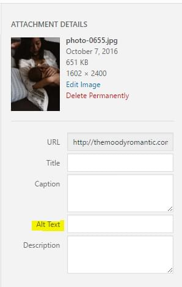

The Moody Romantic</a>"/>

There is a lot of misinformation surrounding search engine optimization and how to perform well on the internet. Let's look at some SEO basics, some SEO myths, and general strategies for how to utilize your website for your business. I have written this post targeting photographers and photography websites, though most of the advice applies to any small business website.

Additionally, most of this applies to search engines, but several things especially near the end apply to acquiring traffic and online/offline interest in your website and services rather than search engines specifically.

---

A bit about me  -  I have been developing and managing websites professionally for the past 9 years and as a hobby before that. I have assisted small businesses, non-profits, and startups with their website development, deployment, and operations. Throughout my career so far, I have seen the web grow and evolve and have been exposed to a lot of varied SEO "advice".

I am not an "SEO expert" or "SEO professional". I am a web developer with industry experience and knowledge of some SEO basics.

Those basics are not secrets or tricks, and they're not very exciting. They are also very adequately taught by the [free resources Google offers](https://www.google.com/webmasters/) to webmasters. I'll do my best to link to other resources / sources in case you would like more information.

---

## The SEO Mindset

To understand SEO for your photography website, you need to first understand one very important thing: the mindset of Google, the search engine. This greatly affects how any SEO strategy is evaluated. Put simply,

**Google wants to return search results that make its users happy.**

If a user searches for something and they find a high quality search result, then they will be happy and _next time_ they need to find something, they will remember and use Google to find it.

This has a very important implication: Google's stated goal is to make its users happy, and its users are happy when they find what they want, so if you want your website to be visible on Google and support your business's goals, you need to provide a website that gives people something they want.

Then your goals and Google's goals are in alignment. You are not fighting Google's "algorithms", you are not "tricking" Google to rank well, you are providing a positive resource for real people who are looking for you, and Google is playing matchmaker.

We can use this lens to evaluate any SEO strategies. Our goal is to provide a quality resource for people and ensure we have the technical basics covered so that Google is able to accurately read and categorize our website. Then when people look for what you have to offer, there will be a match.

## SEO Basics

Your website has to contain quality content that people like / want / interact with / find value in. Then your website has to be readable by Google in order for Google to know it exists and serve it as a search result.

### Write Quality Content

The foundation of good SEO is to provide content that people want, something that someone somewhere will be looking for. This could be:

- A quality portfolio of images representing your services / style  -  Google has visual search and is able to find images of similar style. Most importantly you want your potential clients to understand your current style, in addition to any benefits you may get from Google visual search
- Text describing clearly the type of services you offer and details that you expect people will search for / need
- Any other textual information that your target website visitors would enjoy or be looking for (blog posts that would be interesting to visitors, etc.)

More below about several of these.

### Don't Put Text Inside Images

One practice that is opposed to good SEO is putting text inside images, usually done for stylistic effect:

And there's even a typo in that image  -  it's harder to fix. Essentially if you add text to an image with an image editor like Photoshop, it will be invisible to search engines. This is not necessarily wrong, just it's just important to know.

Many people have disabilities or use assistive technologies to access their computer, so irrespective of Google, you want to make your website accessible.

If you want your website to look a certain way, but are unable to achieve that look without resorting to designed images that contain textual information, here are two possible solutions:

- **Hire a web designer.** A professional web designer will be able to balance visual design with technical implementation in a way that is accessible to your potential clients / Google.
- **Include the information in text in addition to the image.** For example, let's say you are creating a shareable / pinnable image advertising the details of your upcoming workshop. In the blog post or Pinterest pin description or Instagram caption, include all the information in text form a second time. That is the text that Google will be able to understand.

**Similar recommendation:** if your website is powered by Adobe Flash, it suffers the same fate as text-inside-images. It will be hard for your readers or for Google to access. (if you don't know what Flash is, you are probably not using it, though you could ask your webmaster or website host to be sure)

### Include the Phrases that People Will Search For

You likely have an idea of the kind of sessions / clients you wish to attract, so put yourself in their shoes and think about the kind of things that they will search for. If you determine that people will search for "intimate wedding photography San Francisco, CA", it would be a good idea for the phrase "intimate wedding photography" to naturally occur somewhere in your website's text (possibly the about page?) and the city or at least the state to be written somewhere as well.

You want to avoid "keyword stuffing", or just simply including every possible word / phrase you believe people will use on Google. Above all, you want to remain natural and target real people first. Google is smart, and as we mentioned their goal is to provide a good experience to their users, so you want to align with their goals and be natural and helpful. Google has the ability to detect keyword stuffing, and will be able to detect that keyword stuffing is not as useful to its users as natural text.

On the flip side, if you want to be a wedding photographer, the phrase "wedding" and "photography" or synonyms must be somewhere on the website, otherwise it will be very hard to ever perform well for those categories. Additionally, if you target photography in certain geographies, you would do well to mention those in your content. Your clients may well be searching with their location in the search phrase.

### Include Text Descriptions for Images

With some exceptions, search engines operate on text content rather than visual content. This means that the text that accompanies your images can be very important when considering search engines.

In your portfolio gallery for example, most website platforms will have an easy way to add something call "alt text" to images. This is "alternate text", or the text that describe the images. This is used in any case where the image cannot be understood visually, like by a search engine or by a user with a visual impairment.

You want to avoid "keyword stuffing" here as well. It is much better to describe the image as you would to another human, taking care to describe it as you wish it to be described / discovered. "Moody romantic couple next to Oregon coast" is much better than "Moody romantic Oregon beach coastline waves sand couple man woman".

Adding alt text to an image in WordPress is simple, just fill it in the box labeled Alt Text:

There are similar such options in Squarespace and many other website platforms.

Additionally, if you have an image next to regular body (paragraph) text, search engines will use that text to get an idea of what the image is about, in context with the rest of the page.

> See also: [Add Alt Text in Squarespace](https://support.squarespace.com/hc/en-us/articles/206542357-Adding-alt-text-to-images)

### Pay Attention to Your Website's Title / Description

Your website has a "title" for every page on your website  -  that's the text displayed at the top of your browser window, on the browser tab, or in the bookmarks bar when you bookmark your website. Additionally this title text will be displayed as the search result title. By far, the most important page on your website for the title and description is your homepage:

WordPress (and similar website platforms) allows you to adjust the website "name" and website "tagline" and it combines the two to make your homepage's title. Generally speaking, you want your website's name to be the name of your business and the tagline to describe your business like a tagline would, but also be the most important description of your site that you want to provide to search engines.

Additionally, the text underneath the search results can sometimes be affected by something called a "meta description". If you have not set a custom meta description for your homepage, Google will usually retrieve the first words on the page to display under the search result title. If you are not happy with the words it picked, then that might be a good time to look into adjusting the meta description or the content on the homepage itself.

For WordPress, many of the [free WordPress SEO plugins](https://wordpress.org/plugins/wordpress-seo/) have the ability to do this. By the way, you generally do not need to purchase WordPress plugins for SEO as the free ones cover everything you need. For most things, you don't even need a plugin.

If you would like, you can adjust the page title or description for every page on your website, focusing on the highest-importance pages first (homepage, about page, portfolio, etc.). Usually though having the homepage the way you'd like it is a good enough start.

## SEO Myths

### You Need Tricks or Secrets to Perform Well

No. Search engine optimization and traffic building is a long process. You provide a quality service to real people and follow the basic guidelines set by the search engine itself, and over time your SEO "rank" will improve.

Some websites can benefit from a dedicated SEO consultancy. Such a company will work on content marketing, or writing regular content that is both interesting to readers and search engine accessible. They will optimize the technical aspects of your website to ensure all the basics are covered, adding alt text to images, customizing meta descriptions, etc.

But any strategy or any company that promises secrets or a way to "trick" Google or generally sounds too good to be true are usually scams. You want to be working with the search engines, not against them, as if there are any true "tricks", they will not remain sustainable for long. Google will catch on and penalize any website utilizing them.

Additionally, do your research if you decide to enlist professional SEO help. Be aware that SEO services can be expensive and can start at the base price range of $5k-$20k. Any company offering SEO services for unbelievably low prices is likely not useful at best or a harmful scam at worst.

Here is a link to some [recommended SEO consultancies](https://moz.com/rand/recommended-list-seo-consultants/) if you need.

### You Need to Spend a Lot of Money on SEO to Do Well

Nope, while professional SEO consultancies can be expensive, you would be surprised how many websites do not have the SEO basics mentioned above covered. Putting any effort into providing a quality resource for your visitors will place you above a lot of the competition.

### Link Exchanges ("I'll link to you if you link to me") Help SEO

This falls under a former "trick" that was used to raise the Google rank of websites by artificially making it look like many websites linked to your website, so your website must be an authority on a topic or generally important.

The #1 way I still see this strategy is blog comments, where you are encouraged to comment on somebody else's blog in exchange for a similar comment on your blog.

**This does not help SEO.** Google actually [actively forbids this practice](https://support.google.com/webmasters/answer/66356) (the bullet point about "Excessive link exchanges" directly applies to this kind of linking).

Intentional link exchanges and spam links used to be such a large issue that a special website code called rel=nofollow was invented as a way for websites to link to another website, but instruct Google to not consider the link a "vote of confidence" for the other website.

Today, website platforms like WordPress _automatically_ add that special code to all links in comments. So, if you exchange comments with another blog, Google _will_ ignore the links for the purposes of SEO.

There is one benefit to leaving comments on blog posts and linking back to your website, and that is community building. You comment on other people's blogs with quality comments when you want to participate in the "community discussion", which helps raise your visibility with people, not directly with search engines. More on that below.

## SEO / Visibility Strategies

Here are a few basic strategies for increasing your website's visibility and search rank. But first, in addition to the SEO mindset mentioned at the beginning, there is another guiding principle here:

**Use your head.** Try to avoid "groupthink", or believing that there is one right way to improve SEO and following the crowd from one fad to the next. Try to think for yourself and experiment. Avoid anything promising to be the "the only way".

### Be Online for a Duration of Time

The first strategy is passive: allow your website to "age". Google ranks domains higher the longer they have been around. This is for a couple of reasons:

- Brand-new domain names are often used by spammers
- A domain with a older age is a sign of a stable business / resource

For these reasons, when you first launch a new website, you should expect it to take some time for it to appear on Google's radar for search terms that have competition. It will take time for your domain to age.

### Participate in Your Community

As a general marketing strategy, you want to participate and be a positive influence in your community. This means you may want to comment on a blog post, not for the purposes of another "looks great" comment + link, but to participate in the community discussion. Your comment should be quality content essentially.

Write regular blog posts, ones that people will be interested in and want to read. If you have a regular readership, offer the ability to subscribe to an email newsletter. Communicate with peers and potential clients on social media. Talk to somebody at the conference you're attending. Speak at the conference.

You are getting your name out there, helping others, receiving feedback, and giving back to the world. This will provide inspiration and benefit to you personally and as a business, and from an SEO/marketing perspective, you are creating value and are building something that people will want to share and link to. Remember, Google wants to surface quality content to its users, and if you are a positive element in your community, that will translate into online influence as well.

### Keep Your Website Up To Date

You should make sure the content on your site stays up to date. This is important to your visitors / clients, and updating your content signals to Google that your business is still alive and well.

This doesn't mean you have to continually rewrite your about page, but that you should keep the information current. Also, having a regularly-updated blog with interesting content /photos is a good idea. The regularity of posts is more beneficial than the quantity, so if you add one blog post per month, that is better than adding 12 blog posts in a week then waiting several months for the next burst of posts.

## Other Resources

Here are a few videos directly from Google on various SEO topics:

### What are some myths about SEO?

<iframe src="https://www.youtube-nocookie.com/embed/gJ9Xt5PohgU" frameBorder="0" allow="accelerometer; autoplay; encrypted-media; gyroscope; picture-in-picture" allowFullScreen></iframe>

### 5 common mistakes in SEO (and 6 good ideas!)

<iframe src="https://www.youtube-nocookie.com/embed/6AmRg3p79pM" frameBorder="0" allow="accelerometer; autoplay; encrypted-media; gyroscope; picture-in-picture" allowFullScreen></iframe>

### What are the top 3–5 SEO areas where webmasters make the most mistakes?

<iframe src="https://www.youtube-nocookie.com/embed/421aTJI2Nxc" frameBorder="0" allow="accelerometer; autoplay; encrypted-media; gyroscope; picture-in-picture" allowFullScreen></iframe>

### How does Google Search work?

<iframe src="https://www.youtube-nocookie.com/embed/KyCYyoGusqs" frameBorder="0" allow="accelerometer; autoplay; encrypted-media; gyroscope; picture-in-picture" allowFullScreen></iframe>

### Google Webmasters

Google provides a lot of resources on the topic at [google.com/webmasters](https://www.google.com/webmasters/). Check it out!
